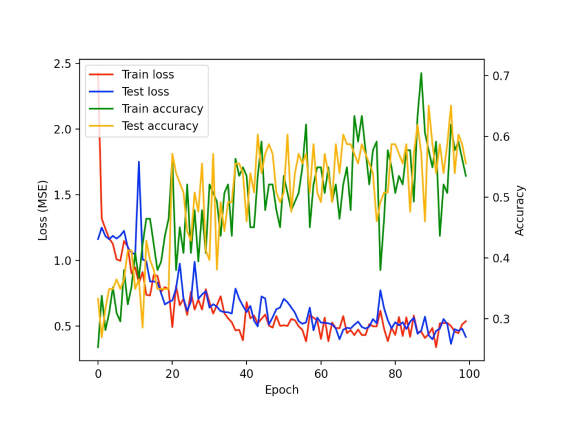

<div align="center">
  
  <h1>Contraction</h1>

  <p>
    <strong>Graph neural networks for contraction prediction</strong>
  </p>

  <hr />
</div>

## About

An _edge contraction_ is a graph operation where an edge is deleted and its two vertices are merged into one. The new vertex then shares the union of the neighbors from the original two. A _vertex contraction_ on a colored graph is a similar operation: contracting a vertex is equivalent to performing edge contractions on all edges to neighbors that share the same color.

The goal of this project is to implement an efficient search over graph contractions such that an arbitrary graph can be contracted down to a single vertex in as few operations as possible.

Heuristics like centrality, node degree, and [Markov constraints](#Markov-Constraints) can speed up the search considerably. However, for very large graphs with many vertices and many colors brute force search quickly becomes intractable. However, humans are able to solve these puzzles fairly quickly with visual intuition and very shallow backtracking search. This disparity feeds the intuition that a deep learning approach may yield better performance.

## Methods

To guide search we embed the graph using a graph convolutional network (specifically `GCNConv` from [PyTorch Geometric](https://pytorch-geometric.readthedocs.io)). This architecture allows us to train on graphs of arbitrary shape and size - though we restrict this dataset to planar graphs. In practice, global max pooling improves training stability and leads to faster convergence. Graph attention layers did not seem to provide an advantage over simple graph convolutions, but this may still be a future direction worth pursuing. A final linear layer maps the graph embedding to the predicted value, which estimates the minimum number of contractions needed to fully contract the graph. This estimate is used as a search heuristic, as a replacement for centrality and node degree.

Each iteration of the model-based beam search we embed all candidate graphs, estimate their likelihood of requiring few contractions, and use those estimates to rank candidates. Monte Carlo tree search would be an interesting future direction to pursue.

<div align="center">
  
</div>

## Installation

Install using [Poetry](https://python-poetry.org/)

```bash
poetry install
```

## Training

```bash
poetry run ctn train --data <data-dirpath> --save --plot --epochs 100
```

<div align="center">
  
</div>

## Discussion

### Markov constraints

In this project we also show that a contraction is a local operation that at most affects the adjacency lists of second-degree neighbors of the contracted vertex. Therefore, two contractions not in the degree two neighborhood of each other are causally independent. The ordering of the two operations is always arbitrary and there is a Markov boundary around the degree two neighborhood of each vertex.

It's this intuition that leads us to only consider candidate vertices in the degree two neighborhood of the last contracted vertex. This greatly decreases the width of the search tree for sparse enough graphs. Empirically this improves search performance significantly on planar graphs. While this proof is fairly elementary, a cursory literature review did not turn up prior work on this topic, so as far as I know this is a novel proof.

<div align="center">
  
</div>
